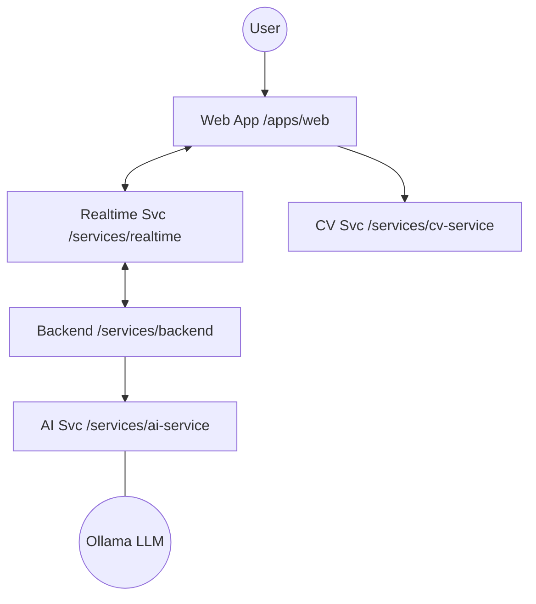

# HoloCollab EduMeet

> **AI-Powered AR Collaborative Learning Platform**  
> Transform remote education with immersive 3D visualization, real-time collaboration, and intelligent AI assistance.

[](LICENSE)
[](https://www.python.org/downloads/)
[](https://fastapi.tiangolo.com/)

---

### 🎯 Overview

HoloCollab EduMeet is a next-generation educational platform that combines augmented reality, computer vision, and artificial intelligence to create immersive learning experiences. Students and educators can interact with 3D models in real-time, collaborate seamlessly, and receive AI-powered assistance—all through a modern web interface.

### 📅 Current Status (March 2026)

- **🚀 AI Upgrade**: Migrated from external APIs to local **Ollama (Llama 3.2)** for low-latency, private AI capabilities.
- **🎥 Presentation Mode**: Full implementation of 3D presentation slides with synchronized zoom/pan controls.
- **🛡️ Algorithm Audit**: Completed a comprehensive audit of AI, CV, Networking, and Rendering algorithms.
- **💎 Premium UI**: Ongoing refinement of the "Neon Purple" high-fidelity design system.

### Key Features

- **🎨 3D Model Visualization**: High-performance Three.js rendering with custom holographic shaders.
- **👋 Gesture Recognition**: MediaPipe-powered tracking for touchless rotation, zoom, and translation.
- **🤖 Ollama AI**: Context-aware assistance for topic detection, lecture notes, and quiz generation.
- **📹 Real-time Collaboration**: WebRTC video/audio with synchronized 3D scene states.
- **✏️ Augmented Whiteboard**: Real-time synchronized drawing layer with 3D shape recognition.

---

## 🏗️ Architecture

HoloCollab EduMeet follows a **microservices architecture** designed for high throughput and modularity:



### Technology Stack

**Frontend (Monorepo)**
- **Framework**: Vite + React + TypeScript
- **3D Engine**: Three.js (WebGL)
- **Computer Vision**: MediaPipe Hands
- **Real-time**: FastAPI WebSocket + WebRTC

**Backend (Python Microservices)**
- **API Framework**: FastAPI
- **Database**: PostgreSQL + SQLAlchemy (Async)
- **AI Backend**: Ollama (Llama 3.2)
- **Networking**: Native WebSocket signaling (FastAPI)

---

## 🚀 Quick Start

### Prerequisites

- **Python 3.9+**
- **Node.js 18+**
- **Ollama** installed and running locally with `llama3.2:1b`.

### Installation & Execution

1. **Clone & Setup**
   ```bash
   git clone https://github.com/yourusername/HoloCollabEduMeet.git
   cd HoloCollabEduMeet
   ./SETUP.bat
   ```

2. **Launch Services**
   The easiest way to start the entire stack is using the provided batch script:
   ```bash
   ./START_DEV.bat
   ```
   *This will start the Backend (8000), Realtime (8002), AI (8003), and CV (8001) services.*

3. **Launch Frontend**
   ```bash
   cd apps/web
   npm install
   npm run dev
   ```

4. **Access**
   - Frontend: `http://localhost:5173`
   - API Docs: `http://localhost:8000/docs`

---

## 📁 Project Structure

```
HoloCollabEduMeet/
├── apps/
│   └── web/           # React + Three.js Frontend
│       ├── src/3d/    # Scene & synchronization logic
│       ├── src/realtime/ # WebSocket & WebRTC managers
│       └── src/pages/ # Responsive UI components
│
├── services/
│   ├── backend/       # FastAPI - Auth, DB, Session Mgmt
│   ├── ai-service/    # Ollama integration & logic
│   ├── cv-service/    # MediaPipe gesture recognition
│   └── realtime/      # State sync & room management
│
├── infrastructure/    # Docker & deployment configs
├── scripts/           # Automation & startup scripts
└── docs/              # Detailed documentation
```

---

## 🎮 Usage

### Joining a Session

1. Click "Join Session" on the home page or navigate to `/join`
2. Enter the 6-character room code provided by the host
3. Enter your name and click "Join Session"
4. You will be connected to the live session with shared 3D models

### Gesture Controls

- **✊ Fist**: Reset model position
- **☝️ Pointing**: Move model
- **✋ Open Hand (Left/Right)**: Rotate model
- **🤏 Pinch**: Zoom in/out

### AI Assistant

Ask questions about the 3D model:
- "Explain the structure of this model"
- "Generate a quiz about this topic"
- "What are the key components?"

---

## 🧪 Development

### Running Tests

```bash
# Backend tests
cd backend
pytest

# Frontend tests (if configured)
npm test
```

### Code Quality

```bash
# Python linting
flake8 backend/

# Format code
black backend/
```

---

## 🤝 Contributing

We welcome contributions! Please see [CONTRIBUTING.md](CONTRIBUTING.md) for guidelines.

1. Fork the repository
2. Create a feature branch (`git checkout -b feature/amazing-feature`)
3. Commit your changes (`git commit -m 'Add amazing feature'`)
4. Push to the branch (`git push origin feature/amazing-feature`)
5. Open a Pull Request

---

## 📄 License

This project is licensed under the MIT License - see the [LICENSE](LICENSE) file for details.

---

## 🙏 Acknowledgments

- **Three.js** for 3D rendering capabilities
- **MediaPipe** for hand tracking technology
- **Ollama** for local LLM integration (Llama 3.2)
- **FastAPI** for the robust backend framework

---

## 📞 Support

- **Documentation**: [docs/](docs/)
- **Issues**: [GitHub Issues](https://github.com/yourusername/holocollab-edumeet/issues)
- **Discussions**: [GitHub Discussions](https://github.com/yourusername/holocollab-edumeet/discussions)

---

**Built with ❤️ for the future of education**
