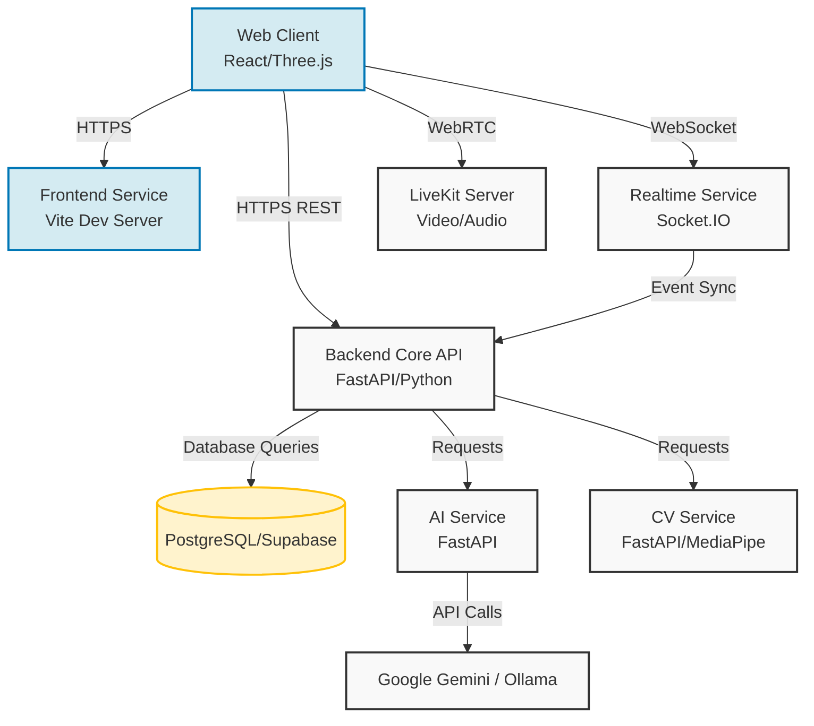

# HoloCollab EduMeet Architecture

## High-Level System Design

HoloCollab EduMeet is built using a microservices-inspired architecture designed to handle real-time video, collaborative tools, AI integration, and computer vision for gesture recognition.

## Service Details

### 1. Frontend Web App (`apps/web`)
- **Tech Stack**: React, TypeScript, Vite, Tailwind CSS, Three.js (for 3D Object rendering)
- **Role**: Serves the primary user interface. Manages WebRTC connections, renders collaborative video rooms, provides interactive 3D model viewing, and handles the chat sidebar.

### 2. Backend API (`services/backend`)
- **Tech Stack**: Python, FastAPI, SQLAlchemy
- **Role**: unified API gateway that handles authentication, user accounts, basic session persistence (meetings/attendance), and routing requests to specialized services.

### 3. Realtime Service (`services/realtime`)
- **Tech Stack**: Python, FastAPI, WebSockets/Socket.IO
- **Role**: Manages real-time data sync across connected clients in a session, such as whiteboard drawing events, chat messages, participant states, and gesture triggers.

### 4. AI Service (`services/ai-service`)
- **Tech Stack**: Python, FastAPI, Google Gemini API, Ollama (Local LLM fallback)
- **Role**: Ingests transcripts and topic models to generate lecture notes, quizzes, AI assistance messages, and session summaries.

### 5. Computer Vision Service (`services/cv-service`)
- **Tech Stack**: Python, FastAPI, MediaPipe, OpenCV
- **Role**: Provides advanced gesture recognition when the client machine is unable to handle local on-device MediaPipe inference, or for specialized heavy-CV workloads.

## Data Flow: WebRTC & Video
1. The **Frontend** requests a session token from the **Backend**.
2. The user connects to the **LiveKit** service (or a custom WebRTC STUN/TURN server) for pure P2P or SFU video/audio streams.
3. Chat and metadata events travel through the **Realtime** WebSocket server.
