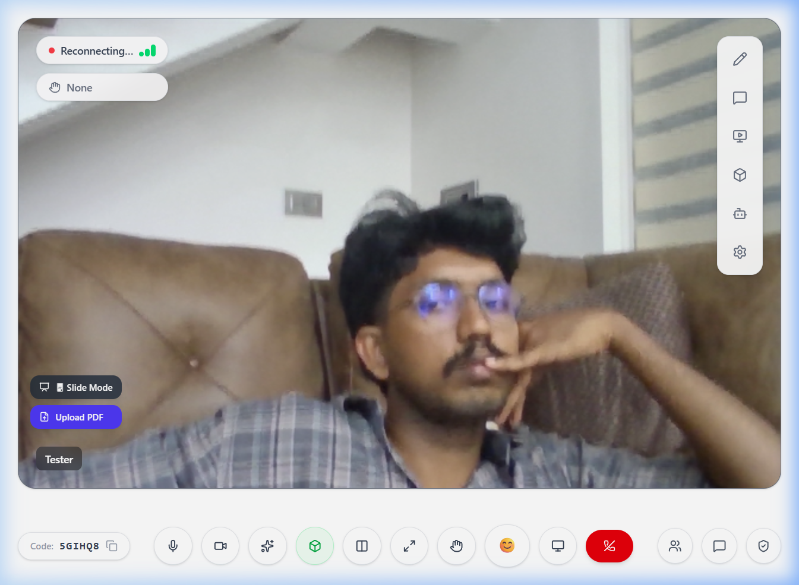
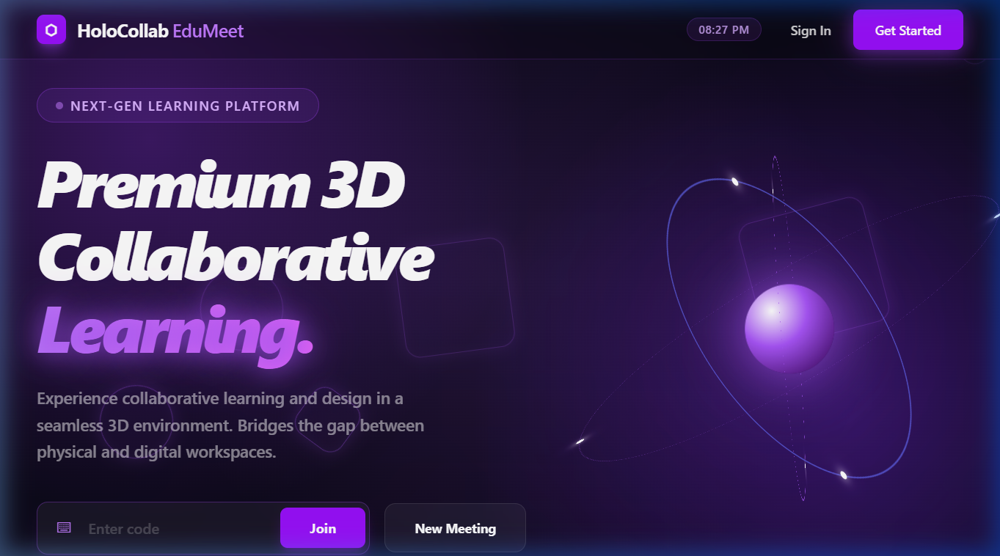

# HoloCollab EduMeet Documentation

## Project Overview
**HoloCollab EduMeet** is an AI-Powered AR Collaborative Learning Platform that brings immersive 3D education to the web.

## Updated Repository Structure
```
HoloCollabEduMeet/
├── apps/
│   └── web/                # React (Vite) + Tailwind + Three.js
├── services/
│   ├── backend/            # FastAPI + SQLAlchemy + Gemini AI
│   └── realtime/           # Node.js + Socket.io Signaling
├── infrastructure/         # Deployment & Containerization
├── docs/                   # Full Manuals & Documentation
└── brain/                  # AI System Design & Architecture
```

## Core Educational Services

### 1. Immersive 3D Lobby & Session
- **Location**: `apps/web/`
- **Tech**: React, Three.js, WebRTC
- **Purpose**: A synchronized environment where students can visualize and interact with complex 3D models.

### 2. AI Intelligence Layer
- **Location**: `services/backend/app/services/ai_service.py`
- **Tech**: Google Gemini Pro
- **Purpose**: Handles automated topic detection, lecture note generation, and final session summarization.

### 3. Real-time Signaling
- **Location**: `services/realtime/`
- **Tech**: Socket.io
- **Purpose**: Manages room synchronization, video signaling, and metadata broadcast (hand gestures, reactions).

### 4. Automated Reporting & Transcription
- **Location**: `services/backend/app/api/sessions.py`
- **Tech**: Web Speech API (Browser) + FastAPI
- **Purpose**: Captures live session dialogue and converts it into structured educational insights for students.

## Documentation Index

- **[Quick Start Guide](../QUICK_START.md)**: Get the project running in 5 minutes.
- **[Deployment Guide](DEPLOYMENT_GUIDE.md)**: Launch to Render, Vercel, or AWS.
- **[Testing Protocol](TESTING_GUIDE.md)**: How to verify WebRTC and Gesture recognition.
- **[Architecture Deep-Dive](../brain/system_design.md)**: Core design patterns and data flows.

## Demo & Assets
- **Session Preview**: 
- **AI Analytics**: 

---
© 2026 HoloCollab EduMeet Team. All rights reserved.
