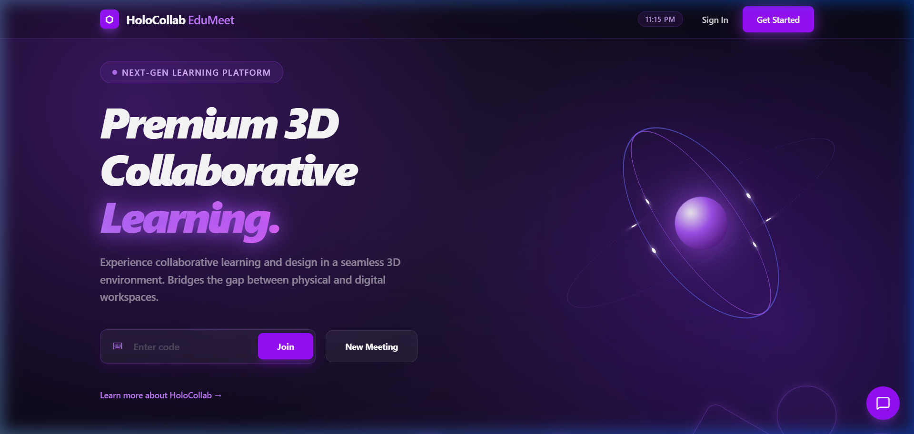
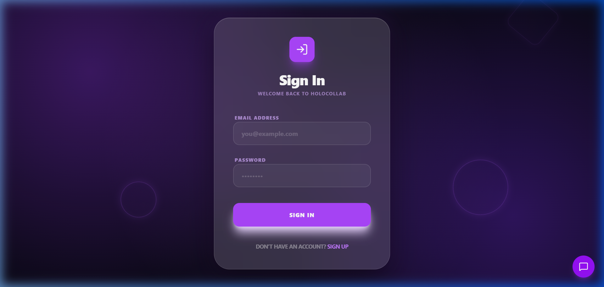
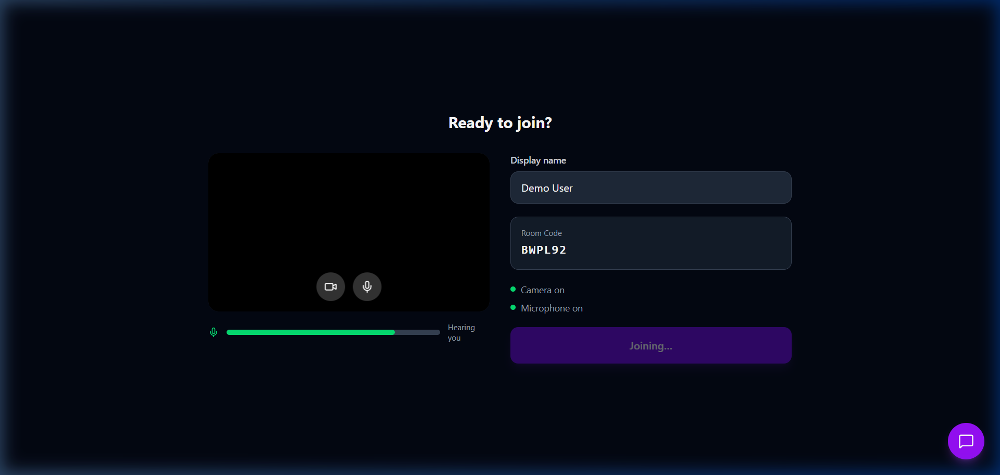
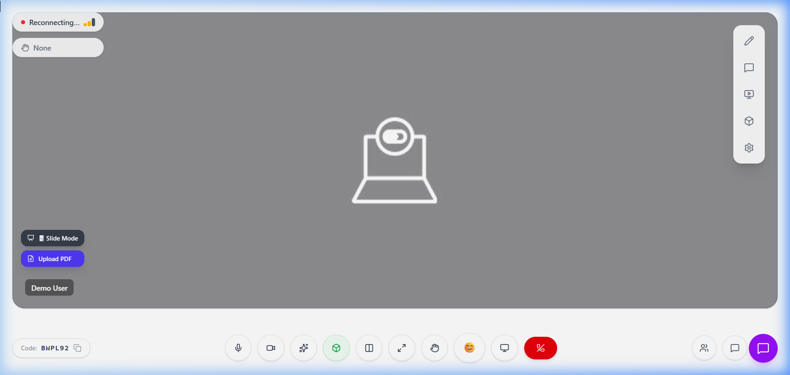

# HoloCollab EduMeet: Project Status Report

## Project Overview
HoloCollab EduMeet is an AI-powered AR collaborative learning platform designed to facilitate immersive educational experiences. This report demonstrates the current working state of the application.

---

## 1. Landing Page
The landing page serves as the entry point for users, highlighting the core features of the platform.

---

## 2. Secure Authentication
The platform features a secure login and signup system with form validation and real-time feedback.

---

## 3. User Dashboard
After logging in, users are presented with a personalized dashboard where they can manage their sessions and view active meetings.

---

## 4. Pre-Join Lobby
Before entering a collabroative session, users can preview their camera/mic settings and ensure they are ready for the session.

---

## 5. Interactive Session Room
The core of the application where users interact with 3D models, engage with the Gemini AI assistant, and collaborate in real-time.

---

## Technical Summary
- **Frontend**: Vite + React + Three.js
- **Backend**: FastAPI + SQLAlchemy
- **Realtime**: WebSockets + LiveKit
- **AI**: Google Gemini (google-genai SDK)
- **Deployment**: Ready for deployment via `deploy-free.sh`
